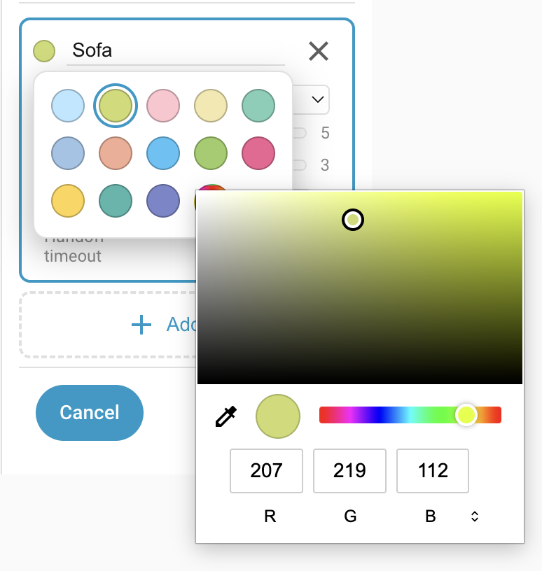

# Detection zones

A zone is a named set of grid cells — typically a region of your room you care about, like "Desk", "Sofa", or "Doorway". Each zone gets its own occupancy and target-count entities in Home Assistant, which you can use in automations.

## The zone list

Open the Device Configuration tab and switch the sidebar to the **Detection zones** editor mode. The sidebar shows two things:

- A permanent **Room** entry at the top. This is the zone 0 fallback (see below).
- A list of your named zones. You can have up to seven. The **Add zone** button is disabled once all seven slots are used.

## The Room zone (zone 0)

The first entry in the list, labelled **Room**, is zone 0 — the "rest of room" fallback. Any target the sensor sees that isn't inside one of your named zones counts as being in the Room zone. It's always present and can't be deleted.

Painting the Room zone edits the room **boundary** itself.

- Click a grey cell **outside** the current room → the cell is added to the room.
- Click a white cell **inside** the current room → the cell is removed from the room (it's no longer considered part of your room at all).

Keep the boundary tight to your real walls. Cells outside the room are ignored by the zone engine, and overlays and named zones can't be painted on them either.

!!! note
    You can mark cells as **outside** even if they're completely surrounded by **inside** cells. Imagine a column in the middle of the room: it's effectively outside the room, even though the room wraps around it.

## Creating and painting a named zone

Once calibration is done and the room boundary looks right, add your first named zone:

1. Click **Add zone** in the sidebar. A new zone appears, selected and ready to paint, with a default name and colour.
2. On the grid, click and drag to paint cells into the zone. The action for the whole drag is set by the first cell you press on. If that cell is already part of the zone, the stroke erases; otherwise it paints.
3. Release the mouse to commit the stroke.

Touch works too: paint by dragging a finger on the grid. The editor is usable on a tablet.

## Renaming, recolouring, deleting

- **Rename** — click the zone name field in the sidebar and edit inline. The new name takes effect immediately.
- **Recolour** — click the colour dot next to the zone name to open the colour picker. Pick one of the preset swatches, or choose **Custom colour** for any shade. A small marker flags presets already used by another zone, so it's easy to keep each zone distinct. The live overview uses the colour to shade the zone.
- **Delete** — click the **×** button on the zone's sidebar row. The zone disappears and any cells it held fall back into the Room zone.

## Per-zone settings

The LD2450 target tracker drops a target after a few seconds without any movement — what you'd expect for someone asleep in bed. To stop zone presence sensors from flapping every few seconds, you tell each zone what kind of presence to expect. Different areas behave differently:

- a passage sees quick entries and exits.
- a bed holds long-term presence with little movement.
- a doorway is where targets appear out of nowhere.
- a sofa is reached by walking through an adjacent zone first.

Each zone has a **type**, which picks sensible defaults for four behaviour thresholds. For most rooms, one of the built-in types works without further tuning.

- **Default** — balanced settings. Use for living-room zones, kitchen zones, generic "somebody's in this area" detection.
- **Bed** — long presence timeout for bedroom monitoring. Tuned for someone lying still in bed for extended periods (10-minute presence timeout, high Trigger threshold so casual movement nearby doesn't activate the zone).
- **Seating** — for sofas, reading chairs, dining seats. High Trigger threshold ignores passing traffic, and a longer hold-on means brief stillness doesn't drop presence.
- **Transit** — fast fall-off. Use for hallways and doorways where presence should drop quickly after someone has walked through, so it doesn't keep a light on forever.
- **Custom** — exposes the four thresholds below for direct tuning.

## Zone presence and custom settings

The zone presence algorithm works as follows:

- A zone entity starts in state **Clear**.
- When a target appears in the zone with a *signal strength* at or above the **Trigger** threshold, the zone changes to **Detected**.
- When the target disappears from the zone (without being handed off — see below), the zone moves to an internal **Pending** state. The zone entity continues to report **Detected**.
- If a target reappears in the zone with a signal strength at or above the lower **Renew** threshold, the zone clears the internal **Pending** state and continues reporting **Detected**.
- If no target reappears within **Presence timeout** seconds, the zone entity switches back to **Clear**.

[How detection works](how-detection-works.md#the-zone-state-machine) covers the state machine in more detail, including the firmware's internal **Occupied** state (which is what HA reports as **Detected**).

### Handoff

When a target moves to an adjacent zone instead of just vanishing, the source zone still enters the internal **Pending** state, but it only waits for **Handoff timeout** seconds before clearing. The target has been *handed off* to its neighbour.

Entrances and exits work the same way, since targets there appear and disappear without a continuous track. Cells marked with the **Entry/Exit overlay** (see [Overlays](overlays.md)) always use the **Handoff timeout** in place of the **Presence timeout**.

## Entities exposed in Home Assistant

Each configured zone has two entities:

- **Zone Presence** (`binary_sensor.<device>_zone_<N>_presence`) — `on` while the zone is detected. The integration renames these to follow the zone: a named zone becomes `Zone <name>` (e.g. `Zone Sofa`), and Zone 0 becomes `Zone Rest of Room`. Zone 0's presence sensor is `on` whenever the sensor sees a target anywhere in the room that isn't inside one of your named zones.
- **Zone Target Count** (`sensor.<device>_zone_<N>_target_count`) — the number of tracked targets currently inside that zone, with the same `Zone <name>` / `Zone Rest of Room` display-name treatment.

**Zone Presence** entities are enabled by default. **Zone Target Count** entities are disabled by default. Both are toggled in [Entity settings](settings/entities.md).

## Troubleshooting

| Symptom | Likely cause | Fix |
| --- | --- | --- |
| New zone created in the panel but no `zone_<N>_presence` entity visible in Home Assistant | The device-level **Zone Presence** toggle is off, so the entity is disabled in the HA entity registry | Enable **Zone Presence** on the device page. To see the disabled entity meanwhile, set Home Assistant's entity-registry filter to "Include disabled entities". |
| Renamed a zone but the HA entity display name still says "Zone N Presence" | Integration hasn't refreshed the entity registry entry yet | Reload the **Everything Presence Pro Grid** integration from Settings → Devices & Services, or reboot the device. |
| `Zone Rest of Room` is always `on`, even when nobody's in the room | An interference source is inside the room but outside any named zone | Paint an Interference overlay on the problem cells. See [Overlays](overlays.md). |
| Zone flaps on and off on someone who isn't moving much | Zone type is "Default", which has a short presence timeout | Change the zone's type to **Seating** (sofa, chair), **Bed** (bedroom), or **Custom** with a longer Presence timeout. |

Still stuck? See [Troubleshooting](troubleshooting.md) for how to open an issue.

## Where to next

- **[Overlays →](overlays.md)** — mark doorways and interference sources on the grid to refine how the zone engine interprets events.
- **[How detection works →](how-detection-works.md)** — the engine behind the scenes: signal strength, the zone state machine, gating, and the Occupancy entity.
