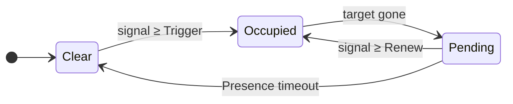
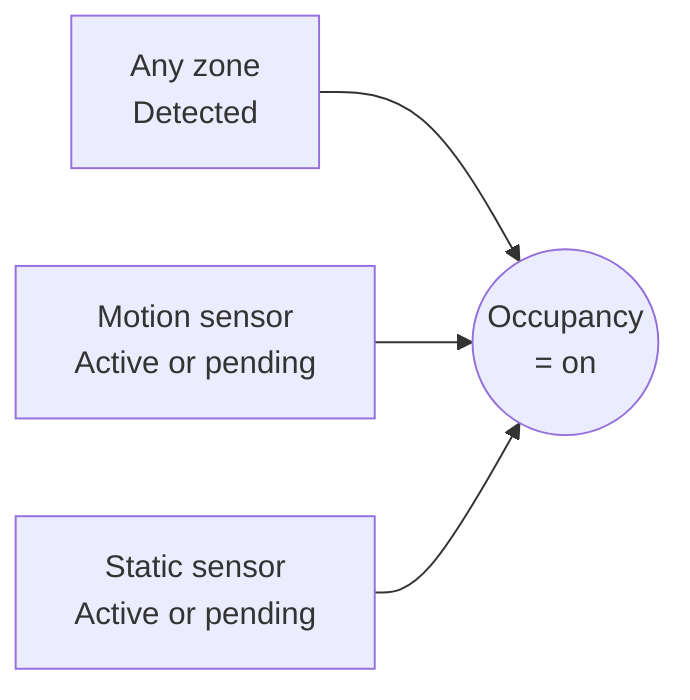
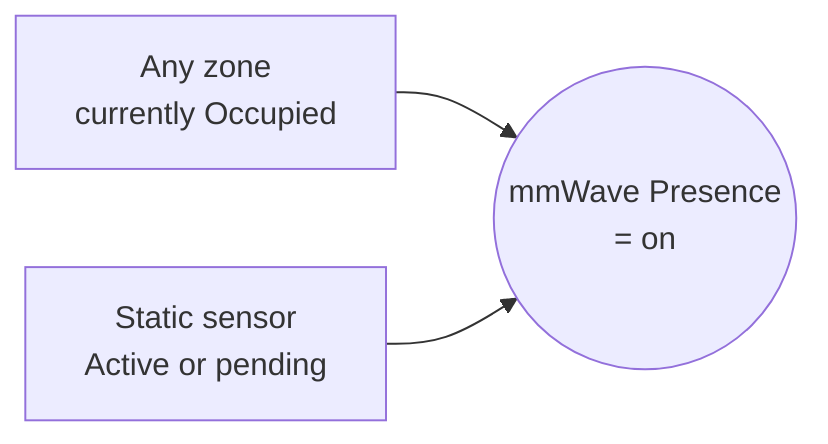

# How detection works

The default settings should normally be sufficient. This page is for when you're tuning a zone or chasing one that misbehaves — it explains what the zone detection engine does between the radar producing a target and Home Assistant seeing a presence entity activate.

## Inputs

Ten times a second the detection engine processes the available data to update room and zone detection status, and target positions. It does that by amalgamating the following information:

- **Targets** — the LD2450 mmWave sensor reports up to three targets at roughly 10 frames per second. Each frame gives an `x, y` position in metres for any target it currently sees.
- **Calibrated grid** — your room is divided into uniform cells. Each cell is either inside the room or outside, optionally belongs to a zone, and may carry an overlay (Entry/Exit, Interference, or Suppress). See [Detection zones](detection-zones.md) and [Overlays](overlays.md).
- **Auxiliary presence sensors** — the SEN0609 static-presence sensor and the PIR motion sensor produce simple on/off signals, independent of the target tracker.

## Smoothing and signal strength

Raw radar positions jitter from frame to frame even when a person is standing still, and individual frames sometimes drop out entirely. The engine smooths this with a one-second window of recent frames, sliding forward each tick:

- The last second of frames is held in memory.
- Each tick the engine takes the **median** of the `x` and `y` values from the frames in which the target was active. The median ignores single-frame outliers; a mean would let one bad sample skew the position. Silent frames don't contribute.
- The window slides one frame at a time. Each tick adds the newest frame and drops the oldest, instead of being chopped into independent one-second buckets.
- The smoothed median position is what the rest of the engine operates on.

The LD2450 produces frames at a fixed 10 Hz — one position update per tracked target every 100 ms — and the engine ticks once per frame. So the smoothed position updates ten times a second, but each update is always backed by a full second of measurements. Consecutive ticks share roughly nine-tenths of their input, which is why the position you see on the live overview glides smoothly across the grid.

The same window produces the target's **signal strength** — the 0-9 number shown next to each target dot on the live overview:

| Signal | Meaning |
| --- | --- |
| 0 | Not seen in any frame this second |
| ~5 | Seen in roughly half the frames |
| 9 | Seen in every frame this second |

Signal is *how reliably the radar saw the target during the last second*. It isn't loudness or distance. A target in clear view typically sits at 8 or 9. Half-occluded by furniture, or near the edge of the field of view, you'll see a steadier 4-6. Treat it as the LD2450's "I'm sure about this target" score.

The Trigger and Renew thresholds described below use the same 0-9 scale, so a Trigger of 5 roughly means "the target must be seen in at least 5 of the 10 frames in the last second for the zone to activate".

## From target to zone

For each active target the engine:

1. Maps the target's `x, y` to one grid cell.
2. Ignores the target if the cell is outside the room or marked Suppress.
3. If the cell belongs to a zone, that zone is the candidate for "this target is here".
4. The cell's overlay (if any) and whether the target was already being tracked from the previous tick decide whether the candidate is accepted, gated, or rejected (covered below).

The same loop runs every 100 ms, so a target's zone assignment can change tick by tick as it moves.

## The zone state machine

Each zone is governed by a small state machine: a fixed set of states with rules for moving between them. Home Assistant only ever sees two outcomes — *Detected* or *Clear* — but internally there's a third **Pending** state that gives the zone a grace period when a target briefly disappears.

Both **Occupied** and **Pending** report as `on` to Home Assistant. The split exists so the engine can ride out short dropouts — radar targets routinely vanish for a frame or two — without flapping the entity.

Two signal thresholds control entry and re-entry:

- **Trigger** — needed to push a *clear* zone into *occupied*. Higher means harder to activate. Defaults vary by zone type (see below).
- **Renew** — needed to keep an *occupied* zone occupied, or to pull a *pending* zone back to *detected*. Always ≤ Trigger, so once a zone is on, less signal sustains it.

The **Presence timeout** is how long a zone sits in *pending* before giving up and clearing.

## Overlays: avoiding ghost activations

A target walking in through a doorway should activate the zone immediately. A target popping up in the middle of a room from nothing is suspicious. The engine treats those two cases differently using *gating* — an extra check applied when a target appears in a clear zone without having been tracked from a neighbouring cell, on a cell that isn't marked Entry/Exit:

- The Trigger threshold is raised by 2.
- Two consecutive ticks (~200 ms) at the raised threshold are required before the zone activates.

That filters out single-frame radar ghosts at the cost of a small entry delay. Cells with an **Entry/Exit** overlay skip gating entirely. A target appearing at a doorway is almost certainly a real person walking in.

Cells with an **Interference** overlay are stricter still. While the zone is clear, a target that pops up on an interference cell with no continuous track from a neighbouring cell is rejected. The movement of a ceiling fan alone can't trigger the zone. Once the zone is already occupied, a target on an interference cell can still keep it occupied, but the Renew threshold there is forced to 9 — only a perfect-signal frame counts. Fan blades alone shouldn't sustain the zone; a real person standing under the fan will.

Cells with a **Suppress** overlay are skipped completely. Any target that lands on a suppressed cell is ignored — no zone activation, no continuity tracking, no contribution to signal. As far as the engine is concerned, the cell doesn't exist. Use Suppress for fixed sources that consistently fool the radar where Interference alone isn't strong enough to silence them — robot vacuum docks, plants in a draught, fish-tank pumps. The cost is that you also lose detection of real people standing on those cells, so paint sparingly.

For the engine the effect is much the same as marking the cell as outside the room. Suppress is for cells that *are* inside your room and that you want to keep visually inside, without carving a hole in the boundary just to silence one trouble spot.

## Handoff: leaving smoothly

When a target moves from one zone to an adjacent zone, the source zone enters the *pending* state and clears after the shorter **Handoff timeout** instead of the full Presence timeout. The target hasn't disappeared; it just walked next door.

The same shortcut applies when the last target in a zone disappears from an Entry/Exit cell. The engine assumes the person walked out through the doorway and clears the zone in Handoff time. Without this, a hallway light tied to a Transit zone would stay on for the full presence timeout after someone walks past.

## Zone types as preset bundles

A zone's *type* is a named bundle of the four timing parameters above:

| Type | Trigger | Renew | Presence timeout | Handoff timeout | Use for |
| --- | --- | --- | --- | --- | --- |
| **Default** | 5 | 3 | 10 s | 3 s | Generic room areas |
| **Bed** | 8 | 2 | 600 s | 10 s | Sleeping in bed |
| **Seating** | 7 | 1 | 30 s | 10 s | Sofas, reading chairs |
| **Transit** | 3 | 2 | 3 s | 1 s | Hallways, doorways |
| **Custom** | — | — | — | — | Direct tuning |

Picking **Custom** exposes the four values for direct edit. Picking any other type applies the bundled defaults and discards any custom values you set previously.

## The Occupancy entity

Each device exposes a single **Occupancy** binary sensor that combines everything. It's `on` whenever any of these is true:

Use **Occupancy** in automations when you just want "is anyone in the room". Even when every named zone is clear, a static-presence reading from the SEN0609 will keep Occupancy `on` — useful for someone sitting still in a chair you didn't paint a Seating zone on.

The motion and static sensors have their own short pending state so a brief PIR dropout doesn't flap Occupancy off and back on.

## The mmWave Presence entity

A second combined binary sensor, **mmWave Presence**, follows the same recipe as Occupancy with the PIR left out:

Use it when you need to limit the range of the sensors, for instance where you have two sensors in a room, each monitoring half the room. It is not possible to limit the range of the motion sensor in the way you can with the target and static sensors. Using the mmWave presence entity allows you to divide the room cleanly into two independent zones. Disabled by default; enable it under Settings → Entities.

!!! tip
    The motion sensor's range can't be tuned — with a clear line of sight it reacts to movement up to 12 m away, including through an open doorway into the next room, which can flip **Occupancy** `on` when no one is actually in the room. **mmWave Presence** leaves the motion sensor out, so where this is a problem, automate on **mmWave Presence** instead.

## Auto-dismiss for stuck targets

The LD2450 occasionally fixates on a phantom — a fan blade caught at just the right phase, a reflection off a glass cabinet, a stationary heat source — and reports it at byte-identical coordinates for as long as the misread persists. Without intervention, that phantom holds whatever zone it lands on permanently *occupied*.

The firmware handles this independently of the zone state machine:

- Each tracker slot keeps a small dwell counter.
- Every tick, if the slot's reported `(x, y)` matches the previous tick's bit-for-bit, the counter rolls forward; if any byte differs, the counter resets.
- Once the counter exceeds the configured timeout (default 5 minutes, configurable in [Sensor calibration → Target sensor](settings/sensor-calibration.md#target-sensor-ld2450)), the firmware auto-dismisses that target through the same path as a manual click-dismiss in the [live overview](live-overview.md). The zone collapses to *clear* if no other targets remain, and the dismissed slot is suppressed at that cell until the radar reports it somewhere different.

A real person never sits perfectly still at the radar's millimetre-level reporting resolution — even motionless breathing or micro-movements show up as 1–3 mm jitter — so the byte-exact rule effectively ignores anyone real. Only a sensor genuinely stuck on a phantom triggers it. Setting the timeout to 0 disables the feature entirely if you'd prefer to handle it via overlays.

A target that auto-dismissed re-appears immediately if the radar later reports it at any different coordinates, so a real person who happened to dwell unusually still won't be permanently lost — they'll come back the instant they shift.

## Sensor-assisted clear

The Bed zone holds the *pending* state for ten minutes. That's deliberate, since someone asleep in bed can drop off the radar for whole minutes at a time. The downside is that a stale *pending* state can keep an **Occupancy** or **mmWave Presence** entity `on` long after the room is actually empty.

The static and motion sensors fix that. The engine watches for a specific combination:

- Static-presence sensor: **inactive**, and
- Motion sensor: **inactive** (in the case of the **Occupancy** entity), and
- No zone currently *occupied* (only *pending* ones remain).

When all three hold, the room is treated as empty and a grace timer starts. Once the room has stayed empty for the configured **Clear delay**, every *pending* zone is force-cleared and Occupancy and mmWave Presence drop to `off`. The reasoning: if neither hardware sensor sees anyone and the radar isn't currently tracking a target, the room is empty and there's nothing to wait for. The delay defaults to 5 s on new installs (set it to **0** to clear immediately); installs upgraded from an earlier version keep clearing immediately until you change it. Any re-detection during the delay — either sensor going active again, or a target re-occupying a zone — cancels the clear and resets the timer.

The whole feature is optional: turn it off under [Sensor calibration → Sensor-assisted clear](settings/sensor-calibration.md#sensor-assisted-clear) and each zone simply clears on its own Presence timeout instead.

!!! note
    The static-presence sensor (SEN0609) and PIR have their own timeouts, configurable in [Sensor calibration](settings/sensor-calibration.md). "Static is inactive" above means the sensor's *own* pending state has already expired, not just that the chip currently reports no presence. The **Clear delay** is a grace period on top of those — the room must read empty for that long before the *pending* zones are cleared.

## Troubleshooting

| Symptom | Likely cause | Fix |
| --- | --- | --- |
| Zone activates briefly when nothing's there | Single-frame ghost slipped past gating | Raise the zone's Trigger threshold, or paint Interference overlay on the cell. |
| Zone never activates when you walk in | Trigger threshold too high for the signal at that distance | Lower Trigger, or check the [Live overview](live-overview.md) to see what signal that cell reports when occupied. |
| Bedroom zone stays `on` long after you leave | The Bed type's *pending* state runs for ten minutes, and the sensor-assisted clear only fires once both the static and motion sensors have gone inactive | Lower the **Static sensor timeout** in [Sensor calibration](settings/sensor-calibration.md) so the static sensor reports empty sooner. |
| Occupancy stays `on` with no visible target and no zone glow | The static or motion sensor is still active or in its own pending state, holding Occupancy on by itself | Wait for the sensor to time out, or lower the **Static sensor timeout** in [Sensor calibration](settings/sensor-calibration.md). |
| Occupancy clears too quickly when somebody is sitting still | Static-presence timeout and zone Presence timeout are both shorter than the time the person stays still | Increase **Static sensor timeout** in [Sensor calibration](settings/sensor-calibration.md), or set the zone's type to **Seating** (or **Custom** with a longer Presence timeout). |

Still stuck? See [Troubleshooting](troubleshooting.md) for how to open an issue.

## Where to next

- **[Furniture →](furniture.md)** — place furniture on the grid so you can read the live overview at a glance.
- **[Detection zones](detection-zones.md)** — paint zones and pick a type.
- **[Overlays](overlays.md)** — mark doorways and noise sources to refine the engine's behaviour.
- **[Settings](settings/index.md)** — tune sensor timeouts, entity exposure, reporting, and more.
